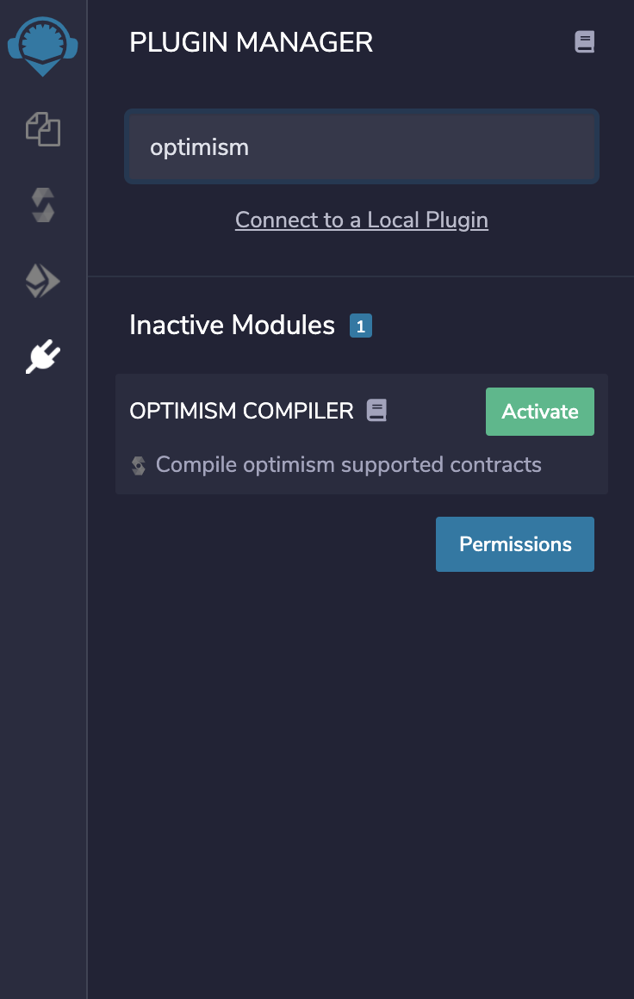
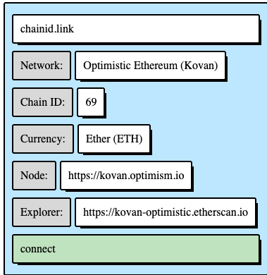
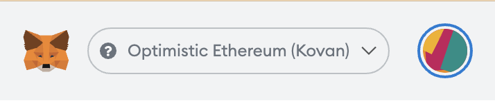
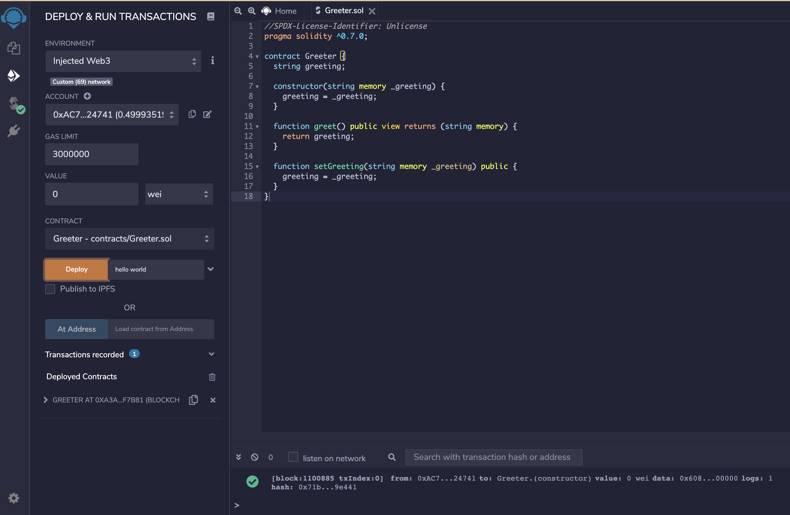

# Remix Optimism Compiler

<TODO>

## Install

In the Remix plugin manager activate Optimism Compiler.



Now you should be able to compile Optimistic compatible smart contracts.

## Deploy to Optimistic Kovan using Remix

For this example we will use the following contract

```javascript
//SPDX-License-Identifier: Unlicense
pragma solidity ^0.7.0;

contract Greeter {
  string greeting;

  constructor(string memory _greeting) {
    greeting = _greeting;
  }

  function greet() public view returns (string memory) {
    return greeting;
  }

  function setGreeting(string memory _greeting) public {
    greeting = _greeting;
  }
}
```

We will assume you have funds in Optimistic Kovan. For a detailed guide on how to send funds to Optimistic Kovan follow [this tutorial](https://community.optimism.io/docs/users/gateway.html).

Now, go to the Optimism compiler and compile the contract.

Switch metamask to Optimistic Kovan by going to [https://chainid.link/?network=optimism-kovan](https://chainid.link/?network=optimism-kovan) and click connect.



Be sure metamask is in the following network:



Now go to the Deploy & Run transactions plugin and select injected provider and deploy the contract.



<IMAGE_DEPLOY>

## Issues

If you have any issues, please feel free to create an issue in our [Github repository](https://github.com/Machinalabs/remix-optimism-compiler-plugin/issues).